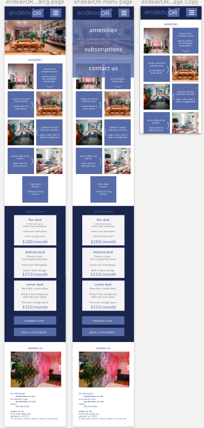

# endeavOR coworking site

#### By _**Kendra Kelly**_

## Description

This project is to build a website for a coworking startup.

* _The first step is to come up with Target Users and User Personas, then research and brainstorm._
* _The second step is to sketch a Desktop, Tablet, & Mobile version of the site._
* _Next, comes the low-fi wireframes._
* _Followed by the hi-fi wireframes._
* _After is protoyping._
* _Then coding and building the actual site._

## Setup/Installation Requirements

* _Clone this repository: https://github.com/coffeeringsdesign/CoworkingSite.git_
* _Use Atom to edit html, css & javascript._
* _Sass for a preprocessor._
* _Sketch to view wireframes and prototypes._

## User Profiles

 | 
---------------------- | -----------------------
 | 
 |

## Research, Inspire, and Brainstorm

#### Step 1 - Other coworking websites

Deskpass | Wework
---------------------- | -----------------------
very nice graphics | very few photos
all needs on one scrolling page | big corporation - too many locations
still has them linked at the top | too corporate!
nice grid gallery showing amenaties | clean but boring
sleek but kind of cold feeling | no colors

TENpod | Collective Agency
---------------------- | -----------------------
clean graphic landing page | not enough whitespace
background images show on mouseover | too much information
grid photos | tl:dr everything
very (too) colorful | not graphic enough
slightly juvenile feeling | eye needs a break

#### Step 2 - Apartment building websites... as a client you want to see where you will be.

Baseline 158 | Indigo @ Twelve West
---------------------- | -----------------------
highlights pictures | great pics that show place
see all the rooms | fixed navigation bar
sticks to two graphic colors | clean but no color
fixed navigation | slow slideshow and animations
two pics with a list of amenities in between | grid gallery
nice flow of info blocks | all on one scolling page

#### Step 2 - Client requests meet research.

###### After comparing and contrasting the good and bad features of the research sites, deciding how each can apply to one of the clients requests, this list is compiled of how to integrate the good with the wants.

* _The first thing the client will see will appear to be a landing page. Good image and intro, but they can scroll down to see all the other information that needs to be presented._

* _While all info will be on the front page (homepage) there will still be a navigation bar fixed at the top to take any visitor (who doesn't scroll) to a simple individual page with that information_

* _There will be two colors to go along with greyscale. This will add brightness and a nice color scheme without seeming overly juvenile._

* _There will be a grid gallery of amenities that will include a description along side in a space in that grid._

* _All information will be quick and easy to read. Not overly busy. Make the eye comfortable._

* _Each key point that they client wants included will get it's own section of the front page. These will be broken apart by color breaks._

## Sketches

Desktop | Mobile
:-----------------------: | :-----------------------:
 | 

Tablet | Individual Pages
:-----------------------: | :-----------------------:
 | 

#### Lo-Fi Wireframes:
Mobile | Tablet | Desktop
:-----------------------: | :-----------------------: | :-----------------------:
 |  | 

#### Hi-Fi Wireframes:
Mobile | Tablet | Desktop
:-----------------------: | :-----------------------: | :-----------------------:
 |  | 

<!-- #### Final Site:
 | 
---------------------- | -----------------------
 |  -->

## Support and contact details

Please feel free to get in touch. Reach out to me at kendra@coffeeringsdesign.com.

## Technologies Used

Node, Webpack, Sketch, Bootstrap, JQuery, & Atom.

### License

*MIT*

Copyright (c) 2018 **Kendra Kelly**
